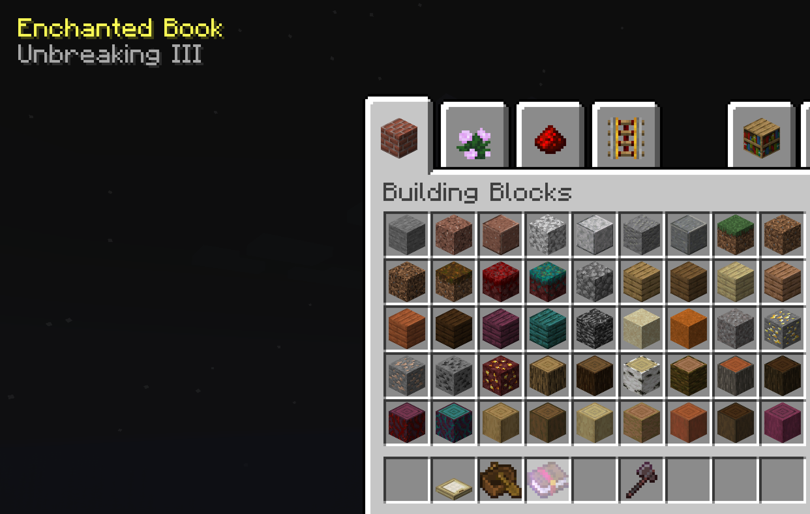

Client-side
## MC- Less Clutter
Configurable Features:

- Removed recipe book

> Removes recepie book item
> purge option will also remove the code the book runs (could cause incompatabilities)

- Vignette

> Disable or change the dark spots in the corner of your screen

- Removed armor hud

> No more pointless chestplate icons
> purge option will just remove the armor value (could cause incompatabilities)

- Static Tooltips  
  

- Less item tooltips

> Reduces the amount of lines a tooltip can have to 1

- Instant crouch

> Removes the camera transition for going prone / sneaking

- Removed hud name display  
  
  
- Dynamic cross-hair  
  
